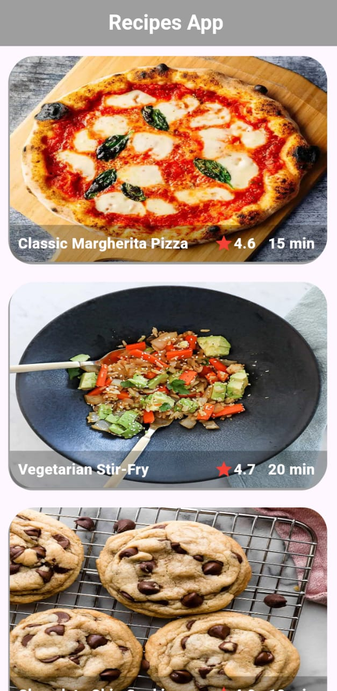
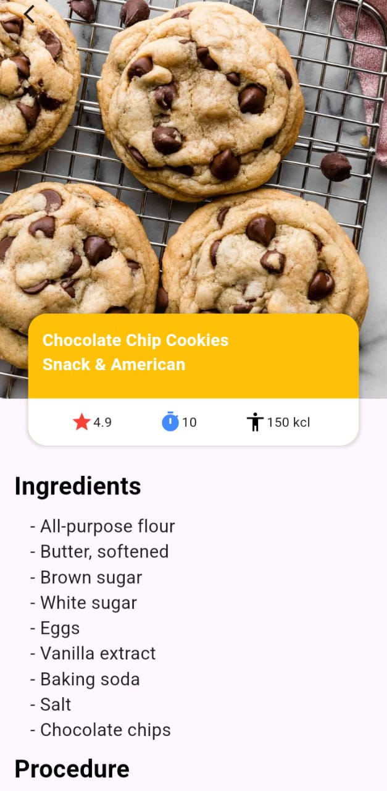

# Recipe App 🍳

## Description
A Flutter app that shows delicious
recipes with ingredients and
step by step instructions.

## Features
- ✅ Browse different recipes
- ✅ View recipe ingredients
- ✅ Step by step cooking guide
- ✅ Beautiful UI design

## Screenshots

## Technologies Used
- Flutter
- Dart
- REST API

## How to Run
1. Clone the repo
   git clone https://github.com/ArfaAppDev/Recipe-App

2. Install dependencies
   flutter pub get

3. Run the app
   flutter run

## Developer
**Arfa Noor**
- GitHub: [@ArfaAppDev](https://github.com/ArfaAppDev)
- LinkedIn: [Arfa Noor](https://www.linkedin.com/in/arfa-noor-254a63365/)